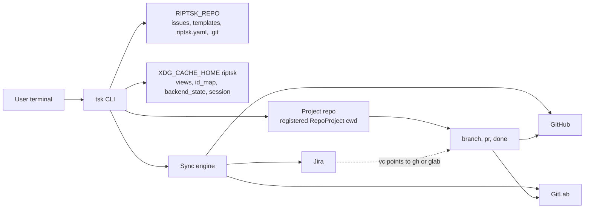
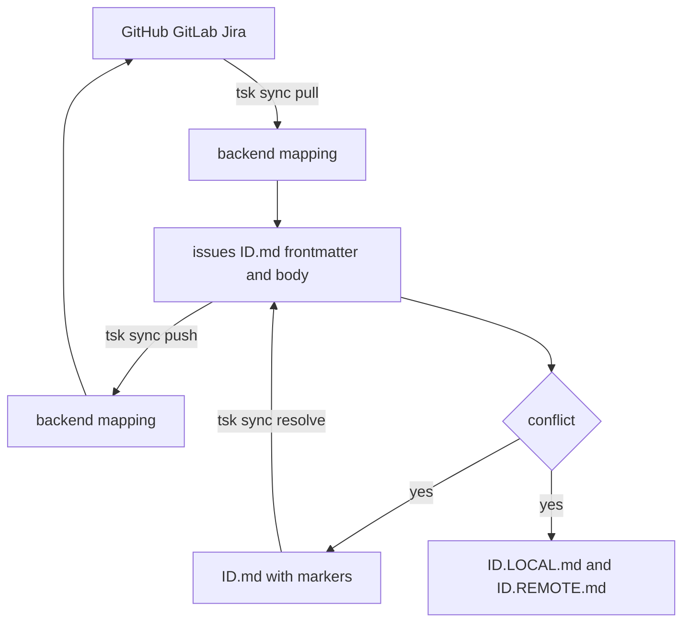
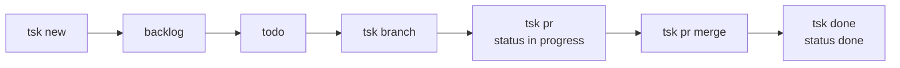
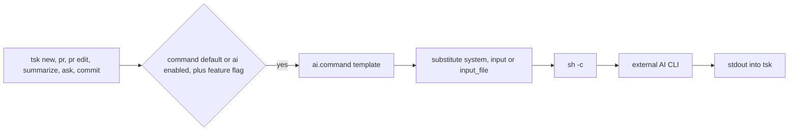
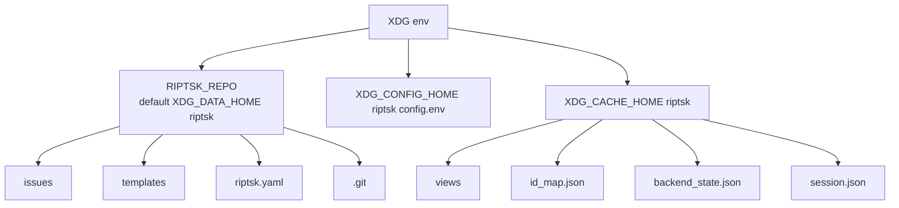

# riptsk

A plaintext issue tracker for the terminal.

- Markdown issues with YAML frontmatter in a local git-backed task store
- Optional sync with GitHub, GitLab, and Jira
- AI features are available, but never required

## Table of contents

- [Quick start](#quick-start)
- [Architecture](#architecture)
- [Installation](#installation)
- [Core concepts](#core-concepts)
- [Issue lifecycle](#issue-lifecycle)
- [Workflows](#workflows)
- [Templates](#templates)
- [Recurring tasks](#recurring-tasks)
- [Sessions](#sessions)
- [AI integration](#ai-integration)
- [Configuration](#configuration)
- [Issue format](#issue-format)
- [Task store maintenance](#task-store-maintenance)
- [Dependencies](#dependencies)
- [Development](#development)

## Quick start

```bash
just install

tsk init
tsk new --title "My first issue"
tsk new --title "My first issue" --description "manual body"
tsk ls
tsk board
```

The default board is `personal`. New issues default to status `backlog`.

## Architecture

High-level architecture:



Sync data flow:



Issue lifecycle:



AI command pipeline:



XDG and task store layout:



## Installation

This repository uses [just](https://just.systems) as its task runner. Install it with `cargo install just --locked` or via your OS package manager before running the commands below.

```bash
just install

# equivalent
cargo install --path .
```

After installing, run `tsk init` before using the task store.

Shell completions:

```bash
tsk completions bash > ~/.local/share/bash-completion/completions/tsk
tsk completions zsh > "${fpath[1]}/_tsk"
tsk completions fish > ~/.config/fish/completions/tsk.fish
```

## Core concepts

### Task store vs project repos

`tsk` keeps issues, templates, and `riptsk.yaml` in one local task store repository. By default that repository lives at `$XDG_DATA_HOME/riptsk`, or `~/.local/share/riptsk` when `XDG_DATA_HOME` is unset.

Project repositories are separate. Commands like `tsk branch`, `tsk pr`, `tsk done`, `tsk clone`, and `tsk unclone` operate in a project repo, while issue files and task-store commits live under `$RIPTSK_REPO`.

### Directory layout

`tsk` resolves paths like this:

| Location | Default | Contents |
|---|---|---|
| `$RIPTSK_REPO` | `$XDG_DATA_HOME/riptsk` | `issues/`, `templates/`, `riptsk.yaml`, `.git/` |
| `$XDG_CONFIG_HOME/riptsk/config.env` | `~/.config/riptsk/config.env` | Optional `RIPTSK_REPO=...` override |
| `$XDG_CACHE_HOME/riptsk` | `~/.cache/riptsk` | `views/`, `backend_state.json`, `id_map.json`, `deleted_keys.json`, `session.json` |

`tsk init` creates the task store, seeds built-in templates, writes `riptsk.yaml`, and initializes a git repo there.

## Issue lifecycle

Create, inspect, and manage issues:

```bash
tsk new
tsk new --title "Fix login bug"
tsk new --title "Fix login bug" --description "manual body"
tsk new --template bug --priority high
tsk new --title "Write spec" --edit
tsk new --title "Refactor auth"

tsk ls
tsk ls --status backlog
tsk ls --priority high --project my-app
tsk ls --all
tsk ls --conflicts

tsk show <ID>
tsk edit <ID>
tsk status <ID> in-progress
tsk close <ID>
tsk reopen <ID>
tsk rm <ID>
tsk path <ID>
```

Notes:

- `tsk ls` defaults to open issues unless `--all` is used.
- `tsk show` prints the raw issue file. If a file contains unresolved sync markers, `tsk` warns but still prints it.
- When `fzf` is installed, commands that take an issue ID can often pick interactively with `--pick` or by omitting the ID where supported.

### Kanban board

The default board is `personal`, with lanes:

- `backlog`
- `todo`
- `in-progress`
- `done`

Board and ordering commands:

```bash
tsk board
tsk board --board personal
tsk board --all
tsk board --open
tsk board --path

tsk view

tsk reorder backlog
tsk reorder-up <ID>
tsk reorder-down <ID>
```

Custom boards and lane sets are defined in `riptsk.yaml` under `boards`.

### Work-clones

For per-issue working directories:

```bash
tsk clone <ID>
tsk unclone
tsk unclone --force
```

`tsk clone` creates a sibling work-clone for an issue branch. `tsk unclone` pushes the current work-clone, removes that clone directory, and prints the main repo path to return to.

## Workflows

All workflow documentation lives in [`docs/workflow/`](docs/workflow/README.md). Start there for end-to-end flows.

- [Branch → PR → Done](docs/workflow/branch-pr-done.md) — `tsk branch`, `tsk pr`, `tsk done`, `tsk start`
- [Backend Sync](docs/workflow/backend-sync.md) — credentials, `riptsk.yaml` backend config, `tsk sync`, conflict resolution
- [Jira + GitLab Setup](docs/workflow/jira-gitlab-setup.md) — Jira for issues, GitLab for branches/MRs

Quick reference:

```bash
tsk new --title "Fix login bug"
tsk branch <ID>            # creates branch + records it in the issue
tsk pr                     # opens a PR (moves issue to in-progress)
tsk done <ID>              # merges PR, cleans up branches, marks issue done

tsk start --title "..."    # new + branch + PR in one step

tsk sync                   # pull then push against the configured backend
```

Backend auth at a glance — full details in [Backend Sync](docs/workflow/backend-sync.md):

```bash
export GITHUB_TOKEN="ghp_..."
export GITLAB_TOKEN="glpat-..."
export JIRA_EMAIL="you@example.com"
export JIRA_API_TOKEN="..."
```

## Templates

Template commands:

```bash
tsk template list
tsk template show bug
tsk template new bugfix
tsk template edit bug
tsk template rm bug
tsk template validate bug
tsk template validate
```

Built-in templates:

- `task`
- `bug`
- `feature`
- `weekly-review`

Notes:

- `show`, `new`, `edit`, and `rm` require a template name
- `validate` accepts an optional template name; without one it validates all templates

## Recurring tasks

Recurring definitions live in `riptsk.yaml` under `recurring`.

```bash
tsk recur list
tsk recur run
tsk recur run 2026-04-01
tsk recur skip weekly-review

tsk recur new \
  --id weekly-review \
  --title-pattern "Weekly review %Y-%m-%d" \
  --frequency weekly \
  --template weekly-review \
  --day-of-week friday \
  --board personal \
  --status backlog
```

Supported frequencies:

- `daily`
- `weekly`
- `monthly`
- `yearly`

Notes:

- `--id`, `--title-pattern`, and `--frequency` are required
- weekly recurrences require `--day-of-week`
- monthly recurrences require `--day-of-month`
- `run` creates due issues and updates `last_run`

## Sessions

Session commands:

```bash
tsk session start <ID>
tsk session end
```

`tsk session start`:

- records the current branch in cache
- resolves the issue
- creates or checks out the session branch
- stores session state in `session.json`

`tsk session end`:

- commits the task store if `$RIPTSK_REPO` has uncommitted changes
- checks out the previous project branch
- clears the saved session state

It does not run sync, pull, or push automation by itself.

## AI integration

`tsk` is AI-provider agnostic. You configure one shell command template in `riptsk.yaml`, and `tsk` renders it with context before executing it with `sh -c`.

### Setup

```yaml
ai:
  enabled: true
  command: "cat {{input_file}} | claude -p --model haiku --system-prompt {{system}}"
```

Or with `config set`:

```bash
tsk config set ai.enabled true
tsk config set ai.command "cat {{input_file}} | claude -p --model haiku --system-prompt {{system}}"
```

### Placeholders

| Placeholder | Meaning |
|---|---|
| `{{system}}` | Shell-escaped system prompt |
| `{{input}}` | Shell-escaped input content |
| `{{input_file}}` | Path to a temp file containing the raw input |

`ai.command` must contain either `{{input}}` or `{{input_file}}`.

### Feature toggles

These live in YAML under `ai.features`:

```yaml
ai:
  enabled: true
  command: "..."
  features:
    new_body_gen: true
    triage: true
    summarize: true
    ask: true
    commit: true
```

`ai.features.*` are YAML-only settings. They are not supported by `tsk config set`.

### Command coverage

Current AI-gated commands:

- `tsk new`
- `tsk pr`
- `tsk pr edit`
- `tsk summarize`
- `tsk ask`
- `tsk commit`

`tsk new` is AI-by-default. If you omit `--title`, it generates title and body. If you
pass `--title`, it keeps that title and still tries to generate the body unless you also
pass `--description`. Other AI-enabled commands still follow their normal config-driven
defaults.

### Example configurations

Claude:

```yaml
ai:
  command: "cat {{input_file}} | claude -p --model haiku --system-prompt {{system}}"
```

llm:

```yaml
ai:
  command: "cat {{input_file}} | llm -s {{system}}"
```

Ollama:

```yaml
ai:
  command: "cat {{input_file}} | ollama run llama3 --system {{system}}"
```

Inline prompt style:

```yaml
ai:
  command: "my-ai-cli --system {{system}} --prompt {{input}}"
```

### Usage

```bash
tsk new --title "Refactor auth"
tsk new --title "Refactor auth" --description "manual body"
tsk pr
tsk pr edit <ID>
tsk pr edit <ID> --no-ai
tsk summarize
tsk summarize --project my-app
tsk summarize --board personal
tsk summarize --cycle 2026-Q1
tsk ask "What are the highest priority bugs?"

tsk commit
tsk commit --no-ai
tsk commit --edit
tsk commit --message "docs(readme): refresh architecture docs"
```

## Configuration

The main config file is `$RIPTSK_REPO/riptsk.yaml`.

Example:

```yaml
version: 1
auto_commit: false

defaults:
  board: personal
  status: backlog
  priority: medium
  assignee: null
  template: task

projects:
  - name: my-github
    vc_backend:
      type: github
      repo: myorg/my-app
      path: /home/user/src/my-app
    tasks_backend:
      type: github
      repo: myorg/my-app
    default_board: personal

boards:
  - name: personal
    statuses: [backlog, todo, in-progress, done]

ui:
  opener: "nvim -R"
  tree_depth: 2
  fzf_opts: "--border"

ai:
  enabled: false
  command: null
  features:
    new_body_gen: true
    triage: true
    summarize: true
    ask: true
    commit: true

sync:
  conflict_detection: true

recurring: []
```

### Settable via `tsk config set`

Exactly these keys are supported:

- `auto_commit`
- `defaults.board`
- `defaults.status`
- `defaults.priority`
- `defaults.assignee`
- `defaults.template`
- `ui.opener`
- `ui.tree_depth`
- `ui.fzf_opts`
- `ai.enabled`
- `ai.command`
- `sync.conflict_detection`

Everything else is YAML-only, including:

- `projects`
- `boards`
- `recurring`
- `ai.features.*`

Shared Jira project setup, including `repo_project_label` partitioning, is documented in [docs/workflow/jira-gitlab-setup.md](docs/workflow/jira-gitlab-setup.md).

## Issue format

Issues are Markdown files in `$RIPTSK_REPO/issues/`.

Example:

```markdown
---
id: WHL-042
title: Fix wormhole stabilizer retry logic
status: in-progress
board: personal
project: wormhole-router
priority: high
labels: [bug, temporal-drift]
assignees: [ppuffin]
cycle: 2026-Q1
order: 1
due: 2026-03-20
id-slug: 42-fix-wormhole-stabilizer-retry-logic
branch: 42-fix-wormhole-stabilizer-retry-logic
pr_url: https://github.com/myorg/wormhole-router/pull/128
pr_number: 128
local_updated_at: "2026-04-07T10:15:00Z"
github:
  repo: myorg/wormhole-router
  issue_id: 42
  updated_at: "2026-04-07T10:15:00Z"
---

## Description

The stabilizer retry logic does not back off correctly...
```

Frontmatter fields in the current schema include:

- identity and workflow: `id`, `title`, `status`, `board`, `project`, `org`, `order`
- planning: `priority`, `labels`, `assignees`, `milestone`, `cycle`, `due`, `weight`, `recurring`
- sync state: `state_reason`, `local_updated_at`, `remote_deleted`
- branch and PR state: `id-slug`, `branch`, `pr_url`, `pr_number`
- backend metadata blocks: `github`, `gitlab`, `jira`
- backend-specific fields: `confidential`, `discussion_locked`, `issue_type`, `locked`, `lock_reason`

Legacy `assignee: <name>` is still accepted when reading older issue files, but new docs and examples should use `assignees`.

## Task store maintenance

The task store is the riptsk repository itself, not your project repository.

```bash
tsk store commit
tsk store commit --edit

tsk store hooks install
tsk store hooks status
tsk store hooks update
tsk store hooks uninstall
```

`tsk store commit` stages `issues/`, `templates/`, and `riptsk.yaml`, then creates a task-store commit. Hook management installs the bundled pre-commit hook into `$RIPTSK_REPO/.git/hooks/pre-commit`.

## Dependencies

### Required

- `git`
- Rust toolchain for building from source

### Optional

| Tool | Used for |
|---|---|
| `fzf` | Interactive issue selection and reorder flows |
| Any AI CLI | `ai.command` integrations |
| `bash` | Managed task-store pre-commit hook execution |
| `yq` and `jq` | Managed task-store hook validation |

## Development

```bash
just lint
just test
just check
```
