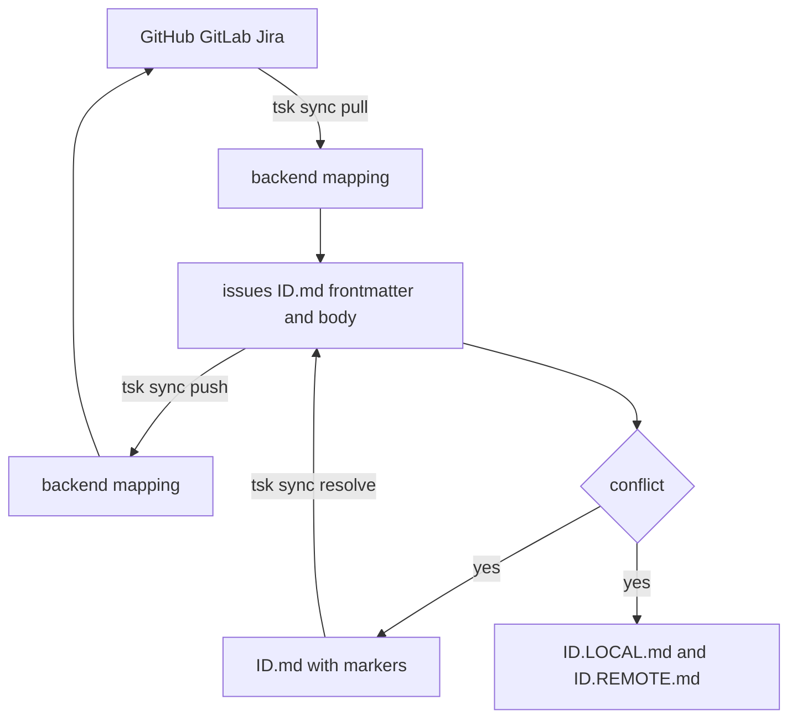

# Sync with GitHub, GitLab, Jira

Backends are configured in `riptsk.yaml` under `backends`.

Sync data flow:



## Backend authentication

GitHub token lookup order:

1. `GITHUB_TOKEN`
2. `GH_TOKEN`
3. `gh auth token`

GitLab token lookup order:

1. `GITLAB_TOKEN`
2. `glab auth status --show-token`

Jira authentication:

- Jira Cloud: `JIRA_API_TOKEN` plus `JIRA_EMAIL`
- Jira Server or Data Center: `JIRA_API_TOKEN`
- Optional override: `JIRA_AUTH_TYPE=bearer`
- Fallback: `jira-cli-go` config and keychain

Examples:

```bash
export GITHUB_TOKEN="ghp_..."
export GITLAB_TOKEN="glpat-..."

export JIRA_EMAIL="you@example.com"
export JIRA_API_TOKEN="..."
export JIRA_AUTH_TYPE=bearer
```

## Auto-detect with `tsk register`

From a project directory:

```bash
tsk register
tsk register --list
```

Detection rules:

- `github.com` remote -> `github`
- any host containing `gitlab` -> `gitlab`
- local git repo with no supported remote -> `local`
- non-git directory -> `local`

Jira is not auto-detected from git remotes. Add Jira backends manually in `riptsk.yaml`.

`tsk` also performs best-effort project auto-registration on startup when the current directory is not already registered.

## Manual backend configuration

```yaml
backends:
  - name: my-github
    type: github
    repo: myorg/my-app

  - name: my-gitlab
    type: gitlab
    host: https://gitlab.internal.example
    repo: team/my-app

  - name: my-jira
    type: jira
    host: https://myteam.atlassian.net
    repo: myorg/PROJ
    default_issue_type: Task
    vc: my-github

  - name: side-project
    type: local
    path: /home/user/projects/side-project
```

Field notes:

- `type` is one of `github`, `gitlab`, `jira`, `local`
- `repo` format is `owner repo` style by backend convention:
  GitHub uses `owner/repo`, GitLab uses `group/project`, Jira uses `org/PROJECT_KEY`
- Jira `host` is required and must start with `https://`
- Jira `vc` may point to a GitHub or GitLab backend for branch and PR commands
- `path` is used for local path-based project detection

## Sync commands

```bash
tsk sync
tsk sync pull
tsk sync pull 42
tsk sync push
tsk sync push 42
tsk sync status
tsk sync resolve <ID>
tsk sync resolve <ID> --take-local
tsk sync resolve <ID> --take-remote
```

`tsk sync` without a subcommand runs pull, then push.

Project selection can be scoped with the standard project flags where supported:

```bash
tsk sync -p my-github
tsk sync --backend my-gitlab
tsk done -p my-github <ID>
tsk done -a <ID>
```

## Conflict resolution

On pull conflicts, `tsk` writes:

- `issues/<ID>.md` with conflict markers
- `issues/<ID>.LOCAL.md`
- `issues/<ID>.REMOTE.md`

Then resolve with:

```bash
tsk edit <ID>
tsk sync resolve <ID>
```

Or restore one side directly:

```bash
tsk sync resolve <ID> --take-local
tsk sync resolve <ID> --take-remote
```

## Related

- [Branch → PR → Done](branch-pr-done.md) — the remote workflow that consumes these backends
- [Jira + GitLab Setup](jira-gitlab-setup.md) — step-by-step for the Jira+GitLab pattern
