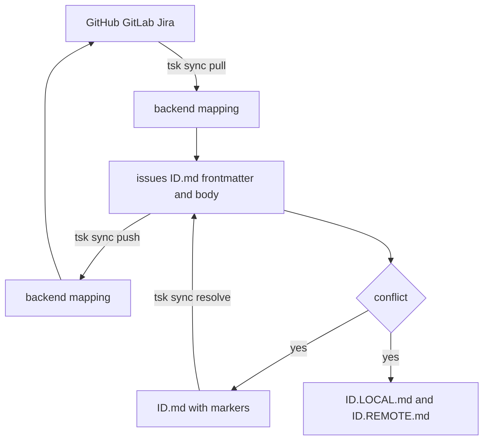

# Sync with GitHub, GitLab, Jira

RepoProjects are configured in `riptask.yaml` under `projects:`.

Sync data flow:



## Backend authentication

GitHub token lookup order:

1. `GITHUB_TOKEN`
2. `GH_TOKEN`
3. `gh auth token`

GitLab token lookup order:

1. `GITLAB_TOKEN`
2. `glab auth status --show-token`

Jira authentication:

- Jira Cloud: `JIRA_API_TOKEN` plus `JIRA_EMAIL`
- Jira Server or Data Center: `JIRA_API_TOKEN`
- Optional override: `JIRA_AUTH_TYPE=bearer`
- Fallback: `jira-cli-go` config and keychain

Examples:

```bash
export GITHUB_TOKEN="ghp_..."
export GITLAB_TOKEN="glpat-..."

export JIRA_EMAIL="you@example.com"
export JIRA_API_TOKEN="..."
export JIRA_AUTH_TYPE=bearer
```

## Auto-detect with `tsk register`

From a project directory:

```bash
tsk register
tsk register --list
```

Detection rules:

- `github.com` remote -> `github`
- any host containing `gitlab` -> `gitlab`
- local git repo with no supported remote -> `local`
- non-git directory -> `local`

Jira TasksBackends are not auto-detected from git remotes. Add Jira-backed RepoProjects manually in `riptask.yaml`.

`tsk` also performs best-effort project auto-registration on startup when the current directory is not already registered.

## Manual RepoProject configuration

```yaml
projects:
  - name: my-github
    vc_backend:
      type: github
      repo: myorg/my-app
      path: /home/user/src/my-app
    tasks_backend:
      type: github
      repo: myorg/my-app

  - name: my-gitlab
    vc_backend:
      type: gitlab
      host: https://gitlab.internal.example
      repo: team/my-app
      path: /home/user/src/my-app
    tasks_backend:
      type: gitlab
      host: https://gitlab.internal.example
      repo: team/my-app

  - name: my-jira
    vc_backend:
      type: gitlab
      host: https://gitlab.internal.example
      repo: team/my-app
      path: /home/user/src/my-app
    tasks_backend:
      type: jira
      host: https://myteam.atlassian.net
      jira_project: myorg/PROJ
      default_issue_type: Task
    repo_project_label: proj::my-app

  - name: side-project
    vc_backend:
      type: local
      path: /home/user/projects/side-project
    tasks_backend:
      type: local
      path: /home/user/projects/side-project
```

Field notes:

- `name` is the RepoProject name used by `-p/--project`.
- `vc_backend.type` is `github`, `gitlab`, or `local`. `jira` is never valid here.
- `tasks_backend.type` is `github`, `gitlab`, `jira`, or `local`.
- `vc_backend.repo` uses `owner/repo` for GitHub and `group/project` for GitLab.
- `tasks_backend.repo` uses the same remote format for GitHub and GitLab.
- `tasks_backend.jira_project` uses `org/PROJECT_KEY`.
- Jira `tasks_backend.host` is required and must start with `https://`.
- `repo_project_label` is optional and Jira-only. When set, riptask adds that label on push, filters by it on pull (`labels = "<label>"`), and strips it from local issue labels after pull. Labels always carry the fixed `proj::` prefix (e.g. `proj::my-app`) so the Jira label unambiguously identifies a RepoProject reference.
- `repo_project_label` auto-derivation order is: git origin tail, then cwd basename. The suffix is sanitized to lowercase, separators become `-`, invalid characters are dropped, duplicates collapse; the final label is the prefix + non-empty suffix, must contain no whitespace or `"`, and be at most 255 bytes. On `tsk register --repo-project-label <value>` the prefix may be omitted — riptask normalizes the input to the prefixed form.
- `path` is used for path-based RepoProject detection. riptask checks `vc_backend.path` first, then `tasks_backend.path`.

## Sync commands

```bash
tsk sync
tsk sync pull
tsk sync pull 42
tsk sync push
tsk sync push 42
tsk sync status
tsk sync resolve <ID>
tsk sync resolve <ID> --take-local
tsk sync resolve <ID> --take-remote
```

`tsk sync` without a subcommand runs pull, then push.

RepoProject selection can be scoped with the standard project flags where supported:

```bash
tsk sync -p my-github
tsk sync pull -p my-jira
tsk sync push -a
```

## Conflict resolution

On pull conflicts, `tsk` writes:

- `issues/<ID>.md` with conflict markers
- `issues/<ID>.LOCAL.md`
- `issues/<ID>.REMOTE.md`

Then resolve with:

```bash
tsk edit <ID>
tsk sync resolve <ID>
```

Or restore one side directly:

```bash
tsk sync resolve <ID> --take-local
tsk sync resolve <ID> --take-remote
```

## Related

- [Branch → PR → Done](branch-pr-done.md) — the remote workflow that consumes these RepoProjects
- [Jira + GitLab Setup](jira-gitlab-setup.md) — step-by-step for Jira TasksBackend + GitLab VCBackend, including shared Jira partitioning
