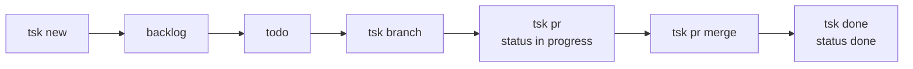

# Branch → PR → Done

The main remote workflow for turning an issue into merged code. Works with GitHub, GitLab, or Jira-backed issues that use a non-local VCBackend for branch and PR operations.

```bash
tsk new --title "Fix login bug"
tsk new --title "Fix login bug" --description "manual body"
tsk branch <ID>
# work in the project repo
tsk pr
tsk done <ID>
```

Issue lifecycle:



## `tsk branch`

Run `tsk branch` from the project repository, not from `$RIPTASK_REPO`.

```bash
tsk branch <ID>
tsk branch <ID> -d
tsk branch <ID> -D
tsk branch <ID> -D --yes
```

Creating a branch:

- resolves the issue
- creates or reuses the remote branch for the issue
- checks out the local branch
- stores both `branch` and `id-slug` in the issue frontmatter

Deleting a branch with `-d` or `-D` clears `branch` and `id-slug` from the issue.

## `tsk pr`

```bash
tsk pr
tsk pr <ID>
tsk pr create <ID>
tsk pr edit <ID>
tsk pr edit <ID> --no-ai
tsk pr edit <ID> -y
tsk pr show <ID>
tsk pr show <ID> --json
tsk pr merge <ID>
```

`tsk pr` without a subcommand behaves like `tsk pr create`.

Verified behavior:

- the current branch must match the issue branch
- creating a PR records `pr_url` and `pr_number`
- if the issue was `backlog` or `todo`, `tsk pr` moves it to `in-progress`
- Jira-backed issues use the Jira issue key in the PR title/body when Jira metadata exists

## `tsk done`

`tsk done` is the convenience wrapper for the full finish flow:

```bash
tsk done <ID>
tsk done <ID> --merge-method squash
tsk done <ID> --auto-merge
tsk done <ID> --timeout 900
tsk done <ID> --force-push
tsk done <ID> --yes
```

When a version-control backend is available and the issue has a branch, `tsk done`:

1. merges the PR
2. checks out the default branch and pulls
3. deletes the remote branch
4. deletes the local branch
5. clears `branch` and `id-slug`
6. marks the issue `done`
7. syncs the issue back to its backend
8. regenerates cached views

When the issue is local-only or the RepoProject has a Jira TasksBackend plus a local VCBackend, `tsk done` skips PR merge, marks the issue `done`, syncs issue state if applicable, and regenerates views.

Manual equivalent:

```bash
tsk pr show <ID>
tsk pr merge <ID> --merge-method squash --timeout 900
git checkout <default-branch>
git pull
tsk branch <ID> -D
tsk close <ID>
```

## `tsk start`

`tsk start` wraps issue creation or selection, then runs branch + PR creation when a version-control backend is available.

```bash
tsk start --title "Implement parser"
tsk start 42
tsk start --pick
tsk start --title "Refactor auth" --template feature --priority high
```

## Related

- [Backend Sync](backend-sync.md) — credentials, configuration, `tsk sync`
- [Jira + GitLab Setup](jira-gitlab-setup.md) — concrete setup for the Jira/GitLab pattern
